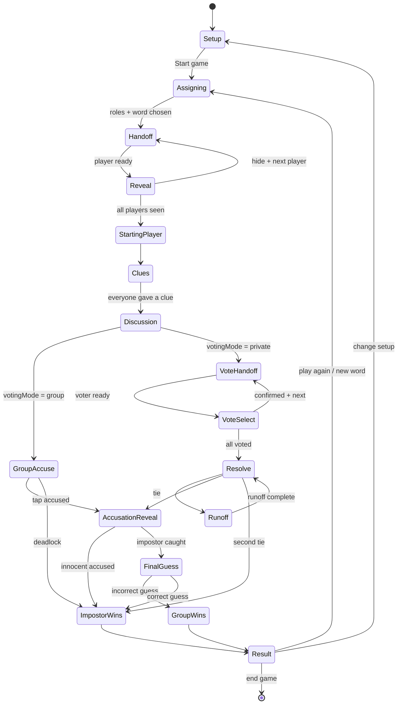
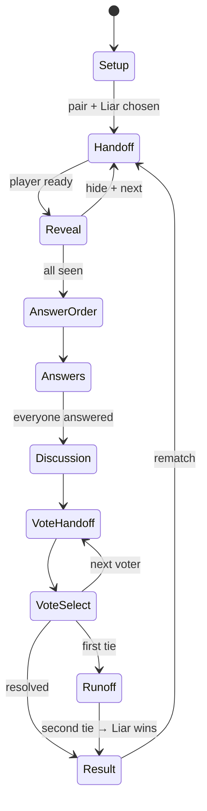

# Chereka Chewata — Architecture Reference

System-level overview lives in [README.md](README.md#architecture). This file goes deeper on navigation, the Impostor session machine, content boundaries, and secret-safety rules that must not regress.

Product rules and screen inventory: [`docs/PRODUCT_SPEC.md`](docs/PRODUCT_SPEC.md). Visual lock: Step 7 in that spec + [`design-reference/brand-identity/`](design-reference/brand-identity/).

---

## App surfaces

One Expo app. Earliest build keeps navigation minimal:

| Surface | Purpose |
|---|---|
| Splash | Brand load; first-time → language, returning → home |
| Home | Brand hero; equal tiles for playable games; quieter coming-next rows |
| i18n | `src/i18n` — interface EN/AM via Settings; content decks stay English-first |
| Game details | Short rules + Play |
| Setup chain | Players → categories → content level → options → review |
| Session | State-machine-driven gameplay screens |
| Settings | Language, sound, vibration, reduce motion, legal |

No mandatory onboarding carousel. No bottom tabs with empty destinations. Packs may open as a secondary screen later.

---

## Route map

Framework route names may differ slightly; product states map roughly to:

```text
/                         splash / gate
/home
/settings
/game/[gameId]            details
/game/[gameId]/setup/*    players | categories | content-level | options | review
/session/[sessionId]/*    handoff | reveal | play | vote | result | summary
```

### Hard rules

1. **Secret data lives in session state, not routes.** Never encode words, questions, roles, or votes in path segments or query strings.
2. **State machine over free navigation.** Gameplay screens advance by events (`NEXT_PLAYER`, `START_VOTING`, …). Arbitrary deep-links into mid-reveal are rejected or reset to a public state.
3. **Back during gameplay** opens an end-game confirmation sheet; it does not pop secretly revealed screens.
4. **Backgrounding during reveal** hides the secret immediately; the same player must reveal again.
5. **Crash resume** may restore public gameplay state only — never a revealed secret screen.

---

## Impostor round lifecycle

First vertical slice. One Impostor by default (two-Impostor deferred).



Implementation:

- Rules / transitions: `src/domain/impostor/machine.ts`
- Setup draft: `SetupContext` (players persist via AsyncStorage)
- Active round: `SessionContext` + `app/session/[sessionId].tsx` → `ImpostorSessionView` (phase switch, not separate secret routes)
- Screens must not invent parallel status flags outside the machine.

## Who’s the Liar? round lifecycle

Second vertical slice. One Liar. Private voting only. No final guess.



Implementation:

- Rules / transitions: `src/domain/liar/machine.ts`
- Setup draft: `LiarSetupProvider`
- Active round: `LiarSessionProvider` + `LiarSessionView`
- Reveal must not label “You are the Liar” — both cards show only “Your question”

### Private handoff pattern (shared)

Used by Impostor role reveal, Who’s the Liar question reveal, and private voting:

1. **Pass screen** — show player name only; no secrets.
2. **Reveal** — press-and-hold preferred; tap acceptable in early prototype. Initial reveal must not advance the turn.
3. **Hide + continue** — deliberate second action; then next player.
4. Prevent swipe-back to previous secrets.

## Would You Rather round lifecycle

The fifth MVP slice has no private state or player setup. Its in-memory machine
cycles through `choice → countdown → discuss`, then advances to the next unique
dilemma in the shuffled session deck. Exhausting the chosen deck ends the
session. Implementation lives under `src/domain/wouldRather/`, with the shared
route rendering `WouldRatherSessionView`.

---

## Content model

Bundled JSON under `content/` for the offline MVP. Shape follows the product spec §8.

```text
content/
  packs/
  categories/
  impostor/          words + hints
  whos_the_liar/     question pairs
  taboo/             target + forbidden
  most_likely/       prompts (later)
  would_you_rather/  dilemmas
```

Common fields: `id`, `game_type`, `category_ids`, `content_level` (`family` | `friends` | `spicy`), `difficulty`, `language_support`, `active`, `premium`.

**Functionality-first rule:** English decks are populated first. Amharic / mixed UI options may exist in settings while content libraries stay English-only or marked coming later.

Loaders in `src/content/` filter by selected categories, content levels, language, `active`, and local suppressions (skipped / reported / recently played).

### Deck selection invariants

- No card repeats in a session until the eligible deck is exhausted.
- Skipped cards stay out for the rest of the session.
- Reported cards are hidden locally until review or data reset.
- Recently played cards are deprioritized across sessions.

---

## Session & storage boundaries

| Concern | Where | Lifetime |
|---|---|---|
| Active session (roles, word, votes, phase) | In-memory store (`src/domain/…`) | Cleared when round/session ends |
| Settings (UI language, content language, sound, vibration, reduce motion) | AsyncStorage | Persistent |
| Last player group | AsyncStorage | Persistent |
| Card history / reports | AsyncStorage | Persistent |
| Bundled decks | App bundle JSON | Updated with app releases |

Sensitive role payloads must be wiped when leaving the round. Do not persist Impostor identity or secret words to disk.

---

## Design system boundary

| Source | Authority |
|---|---|
| Product spec §18 (Step 7) | Locked brand decisions |
| Brand board HTML in `design-reference/` | Visual reference for lockups, UI kit, screens |
| `src/theme/tokens.ts` | Runtime values used by components |

Rules of thumb:

- Dark-first canvas (`midnight` / `void`); game colors are accents, not full-screen backgrounds.
- Primary buttons use **Lamp Honey** with midnight text, min height 56.
- Color is never the only indicator of role, selection, or result.
- Outfit for Latin display; Plus Jakarta Sans for Latin body; Space Mono for timers/chips only; Noto Sans Ethiopic for Amharic.

---

## Platform notes

- Portrait-first; one-handed pass-the-phone use.
- iOS and Android from the same Expo project (EAS Build later for store binaries).
- Screenshot / app-switcher protection on secret screens where the platform allows.
- Haptics and sound are independently toggleable; respect Reduce Motion.

---

## What not to invent

These are explicitly deferred or rejected — do not scaffold them “for later” in a way that shapes the home IA:

- Account graph / auth providers
- Bottom nav with Packs / Shop / History placeholders
- Purple as the universal CTA (superseded by Lamp Honey)
- Encoding game progress in URLs for shareability of secret games
- Backend-required play for MVP games
