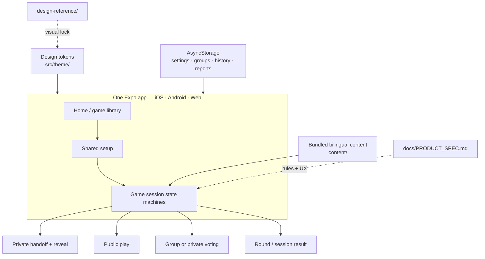

# Chereka Chewata

<p align="center">
  
</p>

> Pass the phone. Start the chaos. — ጨረቃ ጨዋታ

Chereka Chewata is a one-phone party-game app built for Ethiopian living rooms,
dorm floors, and diaspora kitchens. One shared device, no accounts required:
pass the phone, reveal secrets, argue, vote, and laugh.

**Chereka** means moon. **Chewata** means game. The identity lives after dark,
lit by lamplight rather than daylight.

**[Play the live web build →](https://chereka-chewata.vercel.app)**

The web build is a production preview of the same Expo app used for iOS and
Android development. Native store releases are not published yet.

## Current status

- All six MVP games are playable end to end.
- Interface language: English or Amharic.
- Content language: English, Amharic, or Mixed.
- Native builds bundle all gameplay content for offline sessions.
- No account or gameplay backend is required.
- The `main` branch deploys automatically to Vercel.

## Games

| Game | Experience | Players | Names? |
|---|---|---:|---|
| **Impostor** (hero) | Find the player who does not know the secret word | 3–15 | Yes |
| **Who’s the Liar?** | One player answers a different question; spot them | 3–15 | Yes |
| **Taboo** | Timed team word explanation with forbidden clues | 4–20 | Teams |
| **Who’s Most Likely To** | Read a prompt and point at the same time | 3+ | Optional |
| **Who’s Got the Bomb?** | Give category answers while passing a hidden fuse | 2–15 | Yes |
| **Would You Rather** | Choose between two difficult options and debate | 2+ | No |

The familiar game names are temporary. Localized names can land later without
changing the underlying mechanics.

## Product principles

- **One phone, one room:** the app supports the conversation instead of
  replacing it.
- **Private when necessary:** roles, questions, and votes use deliberate
  pass-the-phone reveals.
- **Local-first:** bundled decks, settings, history, and reports do not require
  an account.
- **Ethiopian by substance:** culture lives in the language and cards, not in
  decorative stereotypes.
- **Safe for different groups:** Family, Friends, and opt-in Spicy content
  levels are independently selectable.
- **Accessible by design:** large touch targets, high contrast, optional sound
  and vibration, and reduced-motion support.

## Content library

The current bundled library contains **1,151 bilingual content items**:

| Game | Cards |
|---|---:|
| Impostor | 252 words |
| Who’s the Liar? | 171 question pairs |
| Taboo | 330 cards |
| Who’s Most Likely To | 180 prompts |
| Would You Rather | 170 dilemmas |
| Who’s Got the Bomb? | 48 categories |

Decks live under `content/` and are validated before release. See
[`CONTENT.md`](CONTENT.md) before adding or editing cards.

## Stack

- Expo SDK 57, React Native, and TypeScript
- Expo Router for file-based navigation across iOS, Android, and web
- AsyncStorage for settings, saved groups, card history, and local reports
- Bundled JSON content for offline play
- Vercel for the static web deployment

There is no gameplay backend in the MVP. Active secrets remain in memory and
are cleared when a session ends.

## Architecture



Gameplay is driven by in-memory session state machines. Secret roles, words,
questions, and votes are never stored in route parameters, deep links, or
analytics payloads. Setup choices may survive normal navigation; revealed
secrets do not.

See [`ARCHITECTURE.md`](ARCHITECTURE.md) for session lifecycles, content
boundaries, storage rules, and secret-safety requirements.

## Quick start

Requires Node.js 20+.

```bash
npm install
npm start          # Start Expo and choose a target
npm run web        # Run the web app
npm run ios        # Build and run the iOS development app (macOS + Xcode)
npm run android    # Build and run the Android development app
```

The native commands require Xcode or Android Studio. Physical-device testing
can use a local development build; Expo Go may also work for supported flows.

### Validation

```bash
npm run typecheck
npm run validate:content
npx expo export -p web
```

The production web export is written to `dist/` and deployed using
[`vercel.json`](vercel.json).

## Project layout

```text
app/                      Expo Router screens
src/
  components/             Shared UI and game-specific views
  content/                Content loaders and localization helpers
  domain/                 Game rules, setup state, and session machines
  i18n/                   English and Amharic interface strings
  storage/                Settings, history, groups, and reports
  theme/                  Locked visual tokens
content/                  Bundled bilingual game decks
assets/                   Brand, mascot, icon, and sound assets
docs/PRODUCT_SPEC.md      Product rules and UX decisions
design-reference/         Brand-system source material
scripts/                  Content validation and asset-generation tools
vercel.json               Production web deployment configuration
```

## Sources of truth

| Document | Role |
|---|---|
| [`docs/PRODUCT_SPEC.md`](docs/PRODUCT_SPEC.md) | Living product specification and locked game rules |
| [`ARCHITECTURE.md`](ARCHITECTURE.md) | Session machines, secrets, storage, and content boundaries |
| [`TASKS.md`](TASKS.md) | Shipped work, open polish, and deferred roadmap |
| [`CONTENT.md`](CONTENT.md) | Deck-writing and content-growth guidance |
| [`AGENTS.md`](AGENTS.md) | Repository guidance for coding agents |
| [`design-reference/brand-identity/`](design-reference/brand-identity/) | Brand-board handoff |
| [`src/theme/tokens.ts`](src/theme/tokens.ts) | Runtime implementation tokens |

Where exploratory design material and the Step 7 visual lock disagree, Step 7
and `src/theme/tokens.ts` win.

## Brand snapshot

- **Primary CTA / moon:** Lamp Honey `#FFB646`
- **Background:** Midnight `#0D0B1C` / Void `#080714`
- **Surfaces:** Plum `#1B1533` / Raised `#241C43`
- **Text:** Moonlight `#F6EFE2`
- **Type:** Outfit · Plus Jakarta Sans · Space Mono · Noto Sans Ethiopic
- **Mark:** Crescent moon with three orbiting game dots

## MVP boundaries

The current release intentionally excludes:

- User accounts and cloud sync
- Online multiplayer
- Premium pack commerce
- User-generated or remotely downloaded packs
- Digital voting for Who’s Most Likely To
- Majority Prediction mode for Would You Rather
- Native App Store and Google Play distribution

Current polish and release work lives in [`TASKS.md`](TASKS.md).
