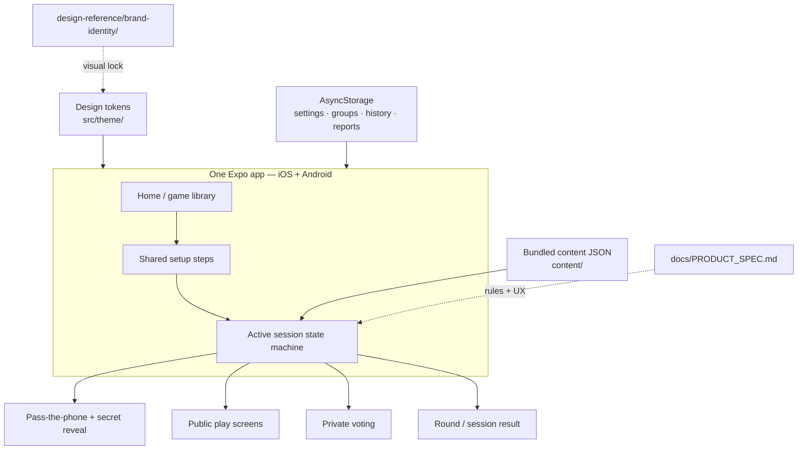

# Chereka Chewata

> Pass the phone. Start the chaos. — ጨረቃ ጨዋታ

Chereka Chewata is a one-phone party-game app built for Ethiopian living rooms, dorm floors, and diaspora kitchens. One shared device, no accounts required, offline after content is on the phone. Pass the phone, reveal secrets, argue, vote, laugh.

**Chereka** means moon — the identity lives after dark, lit by lamplight rather than daylight. **Chewata** means game.

## MVP games

| Game | Experience | Needs names? |
|---|---|---|
| **Impostor** (hero) | Bluffing + deduction; secret word | Yes |
| **Who’s the Liar?** | Personal answers + deduction | Yes |
| **Taboo** | Timed team word explanation | Teams |
| **Who’s Most Likely To** | Simultaneous pointing | Optional |
| **Would You Rather** | Forced choices + debate | No |
| **Who’s Got the Bomb?** | Hot-potato category answers | Yes |

Game names are temporary familiar names. Ethiopian/localized names can land later without changing mechanics.

## Stack

- Expo (React Native) + TypeScript — one codebase for **iOS** and **Android**
- Expo Router (file-based navigation)
- AsyncStorage for settings, last group, card history, local reports
- Bundled English starter content for the functionality-first build; Amharic packs later

No backend is required for the Impostor vertical slice. Accounts, remote packs, and analytics are deferred.

## Architecture



Gameplay is driven by an in-memory **session state machine**. Secret roles, words, and votes live in session state only — never in route params or URLs. Setup choices (players, categories, content level) are preserved when navigating back through setup; secret screens are not kept in history.

See [ARCHITECTURE.md](ARCHITECTURE.md) for the Impostor round lifecycle, content model, and secret-safety rules.

## Product & design sources of truth

| Document | Role |
|---|---|
| [`docs/PRODUCT_SPEC.md`](docs/PRODUCT_SPEC.md) | Living product, game rules, UX flows, locked MVP decisions (v0.4) |
| [`ARCHITECTURE.md`](ARCHITECTURE.md) | App structure, session machine, content/storage boundaries |
| [`TASKS.md`](TASKS.md) | Open work, implementation order, shipped notes |
| [`CONTENT.md`](CONTENT.md) | How to grow bundled card decks |
| [`design-reference/brand-identity/`](design-reference/brand-identity/) | Brand board handoff (Step 7 visual lock) |
| [`src/theme/tokens.ts`](src/theme/tokens.ts) | Implementation tokens — Lamp Honey CTA, midnight surfaces, game accents |

Where Step 6 and Step 7 in the product spec disagree, **Step 7 wins**.

## Quick start

```bash
npm install
npm start          # Expo dev server — press i / a for iOS / Android
npm run ios        # iOS simulator (macOS + Xcode)
npm run android    # Android emulator
```

Requires Node 20+, and Xcode and/or Android Studio for simulators. Physical devices can use Expo Go during early development.

## Project layout

```text
app/                      Expo Router screens
src/
  components/             Shared UI + game shells
  content/                Content loaders
  domain/                 Game rules + session machines
  i18n/                   Interface strings (EN first)
  storage/                AsyncStorage helpers
  theme/                  Locked design tokens
content/                  Bundled card decks (JSON)
docs/PRODUCT_SPEC.md      Full MVP specification
design-reference/         Brand board + assets
```

## Implementation priority

Build in this order (from the product spec):

1. Home + game details
2. Shared setup components
3. Pass-the-phone + secret reveal
4. **Impostor full flow** ← first complete vertical slice
5. Shared voting + results
6. Who’s the Liar?
7. Taboo
8. Who’s Most Likely To
9. Would You Rather
10. Who’s Got the Bomb?
11. Settings, reports, accessibility polish

Do not build all six games’ shells before one Impostor session plays end to end.

## Out of scope (MVP)

- User accounts / cloud sync
- Online multiplayer
- Premium pack commerce (restore-purchases stub only later)
- Full Amharic content library (UI language switch can exist; decks stay English until packs are written)
- Digital voting for Who’s Most Likely To
- Majority Prediction mode for Would You Rather

## Roadmap & tasks

Active work and the Impostor slice checklist live in [`TASKS.md`](TASKS.md). Update it as items land.

## Brand snapshot

- **Primary CTA / moon:** Lamp Honey `#FFB646`
- **Background:** Midnight `#0D0B1C` / Void `#080714`
- **Surfaces:** Plum `#1B1533` / Raised `#241C43`
- **Text:** Moonlight `#F6EFE2`
- **Type:** Outfit (display) · Plus Jakarta Sans (body) · Space Mono (utility) · Noto Sans Ethiopic (Amharic)
- **Mark:** Crescent moon + three orbiting game dots

---

## Below is instructions for ai models

Before you begin, follow these instructions:

- Understand the request fully before making changes.
- Implement all requested changes in one pass whenever possible.
- Use your best engineering and design judgment for minor decisions. Don't stop to ask for confirmation unless there's a major ambiguity or it would significantly change functionality.
- Keep the existing architecture, coding style, naming conventions, and design language consistent.
- Prefer clean, maintainable, and production-ready solutions. Avoid unnecessary complexity or overengineering.
- Make only the changes required for this request. Don't modify unrelated code unless it's necessary to support the requested changes.
- Treat [`docs/PRODUCT_SPEC.md`](docs/PRODUCT_SPEC.md) and [`src/theme/tokens.ts`](src/theme/tokens.ts) as locked unless the user asks to change a product decision — record any override in [`TASKS.md`](TASKS.md).
- Never put secret words, roles, or votes in route params, deep links, or analytics payloads.

For this task, prioritize implementation speed.

Do NOT automatically:

- Run the development server.
- Run builds.
- Run linting.
- Run type checking.
- Run unit, integration, or E2E tests.
- Open the simulator or browser.
- Perform visual verification.
- Take screenshots.
- Repeatedly verify changes after each edit.

I'll handle all testing and verification manually.

If you notice an obvious issue while implementing, mention it in your final summary instead of running tools to investigate it.

When you're finished, provide a concise summary of:

- What changed
- Any assumptions you made
- Anything I should pay attention to while testing

Now implement the following:
